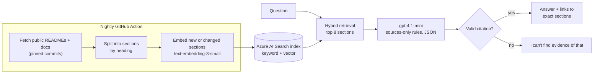

# Ask Barry

A portfolio assistant that answers questions about my software projects using **only** the documentation in my public GitHub repositories, and cites the repo, file and section behind every answer. If the documentation doesn't support a claim, it says so rather than guessing.

**Live:** https://ask-barry.onrender.com

## Current status: Stage 10b complete (RAG live in production, answer quality evaluated, job-ad agent live and evaluated, a second judge tested against hand labels, the same evaluation run on AWS Bedrock)

**Retrieval-augmented generation is live in production:**
- Azure AI Search runs hybrid (keyword + vector) retrieval over my public repo documentation.
- Azure OpenAI (`gpt-4.1-mini`) writes a short answer that must cite the retrieved sections.
- The code refuses any answer without a valid citation.
- `/health` reports search, embeddings and generation as `true` when the Azure settings are present.

**Built so far** ([model card](docs/model-card.md)):
- Flask app with CI and Render deployment
- Document fetching and chunking
- BM25 baseline with a golden question set
- Azure setup
- Azure AI Search index with embeddings
- Retrieval comparison scored at section level
- Grounded answering with citations, rate limiting and a web UI
- Answer-quality evaluation with an evidence-checking LLM judge, cross-checked against a second judge of a different kind (TypeSafe Jev) and my own labels
- An MCP server, so AI assistants can query it as a tool
- Nightly index refresh, and a [model card](docs/model-card.md) with limits and an EU AI Act assessment

| Stage | Scope | Status |
|---|---|---|
| 0 | Skeleton: Flask, tests, CI, Render deploy | Done |
| 1 | Fetch public repo READMEs/docs and split them into sections (no AI) | Done |
| 2 | Keyword search baseline + evaluation question set | Done |
| 3 | Azure setup (Azure OpenAI, Azure AI Search) | Done: [guide](docs/azure-setup.md) |
| 4 | Embeddings + hybrid search in Azure AI Search | Done |
| 5 | Grounded answers with citations (RAG), live | Done |
| 6 | Answer-quality evaluation, including refusal of unsupported claims | Done |
| 7a | Nightly index refresh (GitHub Action) and a check for true-but-uncited answers | Done |
| 7b | Model card, architecture diagram, AI disclosure | Done: [model card](docs/model-card.md) |
| 7c | MCP server: Ask Barry as a tool for AI assistants | Done: [see below](#use-ask-barry-from-an-ai-assistant-mcp-stage-7) |
| 7d | Answer quality compared across model providers | Done: [results](#compare-model-providers-stage-7d) |
| 7e | Infrastructure as code for this project's Azure resources | Done: [infra/](infra/) |
| 8 | Job-ad evidence agent (Microsoft Agent Framework + the MCP tool), evaluated like retrieval | Done: CLI, evaluation ([results](#job-ad-evidence-agent-stage-8)) and web page (`/evidence`) |
| 9a | A second, different judge (TypeSafe Jev) measured against hand-labelled claims | Done: [results](#two-judges-compared-stage-9a) |
| 10a | AWS account set up safely: IAM user with MFA, least-privilege role, temporary credentials | Done |
| 10b | Amazon Bedrock models (Claude Haiku 4.5, Amazon Nova 2 Lite) in the provider comparison | Done: [results](#azure-and-aws-bedrock-compared-stage-10) |

## Architecture



How it works, what it's for (and not for), evaluation results, known limitations and the EU AI Act assessment are in the **[model card](docs/model-card.md)**.

## Sources

Only README and documentation files from my **public** GitHub repositories. No private repositories or source code. Career history comes from a self-reported page in my profile repo (`career.md`), which I wrote from my LinkedIn profile and reviewed; nothing is fetched from LinkedIn (its terms forbid scraping, and a reviewed file in git can't change without me seeing it). Everything the assistant can see is already public.

## Build the document corpus (Stage 1)

```bash
python -m scripts.fetch_docs      # public, non-fork repos of BBSISK -> corpus/ + manifest.json
python -m scripts.chunk_corpus    # heading-aware chunks -> corpus/chunks.jsonl, with a summary
```

- **Selected files:** Markdown at each repo's root, anything under `docs/`, and README files at any depth. Forks, private repos, vendored folders and empty placeholders are skipped.
- **Excluded files:** `DEFAULT_EXCLUDED_PATHS` in `scripts/fetch_docs.py` leaves out public files that aren't evidence of my work, such as interview-rehearsal notes and domain reference catalogues. You can override it with `--exclude-paths`.
- **Pinned versions:** every file is fetched at an exact commit, so each chunk's GitHub link points at the version that was indexed.
- **Chunks:** each chunk carries its repo, file, heading breadcrumb and a link to the exact heading on GitHub (~500 tokens max, one paragraph of overlap, code blocks never split).
- `corpus/` is gitignored, so it can be rebuilt at any time. Set `GITHUB_TOKEN` (read-only) only if you hit the GitHub API rate limit.

## Evaluate retrieval (Stage 2)

```bash
python -m scripts.evaluate_retrieval          # print the report
python -m scripts.evaluate_retrieval --save   # also write docs/eval/<date>-bm25.md
```

- **Golden set:** `eval/golden_set.json` holds 41 answerable questions, each with the file that answers it, plus 8 **trap** questions about skills my public docs don't evidence. The final assistant must decline the traps.
- **No test leakage:** the evaluation reports under `docs/eval/` are excluded from the search corpus, and this README deliberately doesn't quote any test question. Otherwise the search would be "finding" the test instead of the evidence.
- **Results:** see the dated reports and the retriever comparison in [`docs/eval/`](docs/eval/).

## Index into Azure AI Search and compare retrievers (Stage 4)

```bash
python -m scripts.ingest --dry-run                          # what would change (no cost)
python -m scripts.ingest                                    # create index, embed, upload
python -m scripts.evaluate_retrieval --retriever all --save # BM25 vs Azure keyword / vector / hybrid
```

- **Index:** `ask-barry-chunks`, one document per chunk: text, repo, file, heading, GitHub link, and a 1536-dimension `text-embedding-3-small` vector (HNSW, cosine). The vector field is never returned in results.
- **Ingestion only re-embeds what changed:** chunks are compared by content hash, and chunks that disappear from the corpus (e.g. a repo made private) are deleted from the index.
- **Three query modes over the same index:** keyword (Azure BM25), vector (nearest neighbours), and hybrid (both, merged with Reciprocal Rank Fusion).
- **Tests:** all offline, with fake Azure clients, so CI needs no keys.
- **Scoring at section level:** a result counts only if it comes from the right file *and* contains the answer (evidence phrases in the golden set). File-level scoring alone overstated keyword search.
- **Result (27 Sep 2026, 59 chunks, 35 answerable questions), section level:**

  | Retriever | Recall@1 | Recall@5 | Recall@8 | MRR |
  |---|---|---|---|---|
  | BM25 (own implementation) | 0.66 | 0.91 | 0.91 | 0.77 |
  | Azure keyword | 0.74 | 0.94 | 0.94 | 0.81 |
  | Azure vector | 0.66 | 0.94 | 0.94 | 0.74 |
  | **Azure hybrid** | **0.80** | **0.94** | **1.00** | **0.86** |

- **Decision:** hybrid search, passing the top **8** chunks to the answering step (Stage 5), because it's the only setting that retrieved the answer for every question. With 35 questions, one question moves recall by about 0.03, so small gaps are noise. Full reports: [`docs/eval/`](docs/eval/).
- **Update (Stage 7d): the vector side now ignores my name too.** When the nightly job first indexed this repo's own model card and new README sections, they made up 36 of 75 sections and were full of "Ask Barry". The vector half embedded the whole question, name included, so questions mentioning me landed next to those sections. For contact and languages questions, all 8 retrieved sections came from this repo. I compared fixes on the golden set (38 questions, section level):

  | Retriever | Recall@1 | Recall@8 | MRR |
  |---|---|---|---|
  | Hybrid, full question embedded (before) | 0.68 | 0.89 | 0.78 |
  | **Hybrid, name-free embedding (now live)** | **0.82** | **1.00** | **0.88** |
  | Hybrid, max 3 sections per repo | 0.68 | 1.00 | 0.80 |
  | Name-free + max 3 or 4 per repo | 0.82 | 0.97 | 0.88 |

  The simplest fix won, and the per-repo cap stays off. The nightly job now re-runs this check after every refresh and **fails, emailing me, if section recall@8 drops below 0.95**, so a README change that hurts search can't go unnoticed again.

## Grounded answers (Stage 5)

```bash
python -m scripts.ask "How does Wall Inspector deploy to production?"
python -m scripts.ask --show-context "<any question>"      # also list the retrieved sections
flask --app wsgi run                                       # web UI at http://127.0.0.1:5000
```

- **Pipeline:** question → Azure AI Search hybrid retrieval (top 8 sections, the Stage 4 decision) → numbered sources in the prompt → `gpt-4.1-mini` (temperature 0, JSON output) → citation check → answer with links.
- **Honesty rules enforced in code, not just the prompt:**
  - An answer must cite at least one of the sources it was given, or it is replaced with *"I can't find evidence of that in Barry's public GitHub documentation."*
  - Citations to sources that weren't provided are dropped.
  - Unparseable model output becomes an error, never raw text.
- **Web API:** `POST /api/ask {"question": "..."}` returns the answer, `supported`, and the cited sources (repo, file, section, GitHub link pinned to a commit).
- **Public-endpoint safeguards:**
  - Rate limits: 6 questions per minute per IP, and 300 a day overall.
  - Questions are capped at 300 characters, and the app doesn't log question text.
  - Model output is rendered as text, never HTML.
  - No API keys: in production the app signs in with Entra ID and can only read the index (see [Security](#security)).

## Answer-quality evaluation (Stage 6)

```bash
python -m scripts.evaluate_answers --save                     # all questions -> docs/eval/<date>-answers.md
python -m scripts.evaluate_answers --ids profile-10 trap-01   # a subset
```

Each golden-set question is run through the full live pipeline (retrieval, generation and the honesty rules), then scored:

| Check | How |
|---|---|
| Answered | The system gave a supported answer, not "no evidence" |
| Cites the answer | At least one **cited** section is from the right file and contains the answer's evidence phrase (deterministic) |
| Faithful | An LLM judge confirms every claim is supported by the cited text, and that planned work isn't presented as done (or the reverse) |
| Regression checks | Fixed must / must-not phrases for known past failures, e.g. an answer that confused one project's roadmap with another project's history |
| Traps | Pass if the system refuses **or** gives a grounded "no". Fail only if it claims the skill (LLM judge) |

- **About the judge:** it's the same model family, so the headline numbers don't rest on it alone. The citation test and regression checks are deterministic.
- **Tokens per minute:** a full run makes about 80 model calls. Raise the chat deployment's limit (e.g. to 50K tokens per minute) so it isn't throttled; the client also backs off automatically on rate limits.

### Results (27 Sep 2026)

| Metric | Result |
|---|---|
| Answered (37 answerable questions) | 100% |
| Answer cites a section containing the answer | 100% |
| Faithful to cited sources (LLM judge) | 97% |
| Regression checks failed | 0 |
| Traps: no false claim (8 questions) | 100% |
| Passing every check | 44 of 45 |

Full report, including every answer for human review: [docs/eval/2026-09-27-answers.md](docs/eval/2026-09-27-answers.md).

What building the evaluator taught me:
- **Ask the judge for evidence, not a verdict.** The judge lists each claim with a quoted supporting passage, and code checks that every quote really appears in the sources. It matches whole words, so small rewordings pass but new content words don't. A bare yes/no judge gave false negatives that couldn't be audited.
- **Test the evaluator too.** Early versions failed correct answers because of formatting (backticks, HTML in diagrams), a token limit that cut off the judge's output, and a judge that couldn't see the source labels the answering model saw. Each fix came with a unit test.
- **Read the passing answers.** One trap answer passed but speculated about what related work "implied". The answer prompt and trap judge were tightened as a result.
- **Known remaining fault: true but uncited.** An answer occasionally states a fact from a section it retrieved but didn't cite, so the reader can't check it. It's recorded here rather than tuned away.
- **Single runs vary** by a few questions even at temperature 0, so failures are reviewed by cause rather than by headline number.

## Run locally

Requires Python 3.12 (3.10+ should work).

```bash
python3 -m venv .venv
source .venv/bin/activate
pip install -r requirements-dev.txt
cp .env.example .env          # local settings; .env is gitignored
python -m pytest -v           # run the tests
flask --app wsgi run          # open http://127.0.0.1:5000
```

## Deployment

`render.yaml` defines the Render web service (starter plan). Render generates `SECRET_KEY` itself, and deploys only after GitHub Actions CI passes (`autoDeployTrigger: checksPass`).

## Use Ask Barry from an AI assistant (MCP, Stage 7)

`ask_barry_mcp.py` is a small [Model Context Protocol](https://modelcontextprotocol.io) server with one read-only tool, `ask_barry`. It lets Claude Desktop, Claude Code, Cursor or VS Code ask about my projects and get the same cited answers as the website.
- **A thin client:** it calls the live `/api/ask` endpoint, so it needs no Azure keys and inherits the live app's honesty rules and rate limits.
- **Structured output:** the answer, a `supported` flag and the cited sources (repo, file, section, link), so the assistant can keep the citations.
- **Built on the official MCP Python SDK** (stdio transport). Unit tests plus an in-memory client test cover the tool listing, schemas, results and errors.

```bash
pip install mcp                                              # or: pip install -r requirements-dev.txt
python ask_barry_mcp.py --check "How does Wall Inspector deploy to production?"   # smoke test, no MCP client needed
```

Claude Code:

```bash
claude mcp add ask-barry -- /path/to/ask-barry/.venv/bin/python /path/to/ask-barry/ask_barry_mcp.py
```

Claude Desktop (`claude_desktop_config.json`):

```json
{
  "mcpServers": {
    "ask-barry": {
      "command": "/path/to/ask-barry/.venv/bin/python",
      "args": ["/path/to/ask-barry/ask_barry_mcp.py"]
    }
  }
}
```

## Compare model providers (Stage 7d)

The answering step sits behind one small interface (`app/providers.py`) with three implementations: Azure OpenAI (the live app), Anthropic Claude and Google Gemini. Claude and Gemini are called over plain HTTPS, so there are no extra SDKs.

```bash
python -m scripts.check_providers                                   # one tiny request per provider
python -m scripts.evaluate_answers --providers azure-openai anthropic gemini --save
python -m scripts.ask --provider gemini "<any question>"            # try one question
```

- **A fair comparison:** every provider answers from exactly the same retrieved sections (retrieval runs once per question and is cached), with the same prompt, citation checks and scoring. Only the model changes.
- **Measured:** passing questions, faithfulness, true-but-uncited claims, regression checks, trap questions, errors, latency and tokens. A provider error on a question is recorded as a failure, never a pass.
- **Judge bias check:** the judge is one fixed model for all providers, and `--judge anthropic` or `--judge gemini` re-scores with a different judge.
- The live app stays on Azure OpenAI. The other keys live only in local `.env`.

**Result (27 September 2026, 46 questions, the same retrieved sections for every model, judge gpt-4.1-mini):**

| Model | Passing | Faithful | True-but-uncited | Trap questions | Median latency | Tokens out per answer | Cost per answer |
|---|---|---|---|---|---|---|---|
| Azure OpenAI `gpt-4.1-mini` (live) | 43 of 46 | 92% | 3 | 8 of 8 | 1.2s | 72 | ≈ $0.001 |
| Anthropic `claude-haiku-4-5` | 45 of 46 | 97% | 1 | 8 of 8 | 2.0s | 111 | ≈ $0.003 |
| Google `gemini-3.5-flash` | 46 of 46 | 100% | 0 | 8 of 8 | 3.4s | 704 (mostly hidden "thinking") | depends on thinking tokens |

What I take from it:
- **All three are close, and every failure was "true but uncited"**: no invented claims, no regressions and no trap failures. With single runs, a gap of one to three questions is within run-to-run noise. The judge itself was inconsistent: it failed one model's "used Docker in multiple projects" as uncited and passed the same claim from the other two.
- **Trap questions differ in style, not score.** Claude and Gemini refused all eight outright. The live model answered two with a hedged "no", and one of those described what related work "indicates", which is the speculation pattern listed in the model card.
- **No sign of judge self-preference.** The judge is the same family as the live model, yet the live model scored lowest.
- **The live app stays on Azure OpenAI.** It is the fastest and cheapest, it answers from exactly the same evidence, and its failures were citation completeness rather than accuracy. Gemini's quality came with about 10 times the output tokens, because of its internal reasoning.

## Infrastructure as code (Stage 7e)

The Azure resources were first created by hand in the portal ([guide](docs/azure-setup.md)). `infra/` now describes them in Terraform and **adopts them with import blocks**, so nothing is recreated:

| Resource | Terraform |
|---|---|
| Resource group `rg-ask-barry` (Sweden Central) | `azurerm_resource_group` |
| Foundry / Azure AI Services resource (S0, system-assigned identity) | `azurerm_cognitive_account` |
| `gpt-4.1-mini` and `text-embedding-3-small` deployments (Global Standard) | `azurerm_cognitive_deployment` × 2 |
| Azure AI Search `ask-barry-search` (Free, Switzerland West) | `azurerm_search_service` |
| Two app identities and their least-privilege roles (see [Security](#security)) | `azuread_application`, `azurerm_role_assignment` |

- **Safe by design:** every resource has `prevent_destroy`. The first plan found two portal settings the code was missing (the network rule and the search auth-failure mode). After adding them, the plan was *5 to import, 0 to add, 0 to change, 0 to destroy*, and `apply` imported all five without changing anything in Azure (27 September 2026).
- **No secrets:** Terraform never reads or outputs keys, and the subscription ID comes from the signed-in Azure CLI, not the repo. State stays out of git. The five imported resources can be rebuilt from the import blocks; the identities and role assignments in `infra/identity.tf` are created by Terraform, so the state file is backed up outside the repo.
- **Checked in CI:** every push runs `terraform fmt -check` and `terraform validate`, with no Azure access needed.
- **Left out on purpose:** the Foundry project and the budget alert, which were created in the portal. The config comments explain why.

Run it from Azure Cloud Shell, which already has Terraform and the Azure CLI signed in:

```bash
git clone https://github.com/BBSISK/ask-barry.git && cd ask-barry/infra
export ARM_SUBSCRIPTION_ID=$(az account show --query id -o tsv) TF_VAR_subscription_id=$(az account show --query id -o tsv)
terraform init
terraform plan        # expect: 5 to import, 0 to add, 0 to change, 0 to destroy
terraform apply       # records the imports in state; changes nothing in Azure
```

## Job-ad evidence agent (Stage 8)

An AI agent that turns a job advertisement into an **evidence map**. For each requirement it reports whether my public documentation shows it, with links. It's built on **Microsoft Agent Framework** and uses the Ask Barry **MCP server** as its tool.

```bash
python -m scripts.job_agent job_ad.txt --trace     # evidence map + every tool call it made
python -m scripts.job_agent ads/ --save             # a folder of job ads: one .md + .json report each
python -m scripts.evaluate_agent --save            # agent vs a single-shot baseline on 10 test ads
```

**How it works:** the agent reads the ad, picks up to 12 checkable requirements, and calls `ask_barry` once per requirement with a neutral question. If the first answer is unsupported, it may try one rephrasing. It then classifies each requirement as **evidenced**, **related only** (for example, a related tool is documented but not the one asked about) or **not documented**.

**Guardrails** (`app/job_agent.py`, enforced in code, not just the prompt):

| Risk | Guardrail |
|---|---|
| The pasted ad tries to instruct the agent (prompt injection) | The ad is size-capped, stripped of control characters and fenced as data. Nothing it says can create evidence, because of the next row. Before any of that, Azure OpenAI's content safety (Prompt Shields) may refuse an ad that reads like an injection attempt; the agent then reports "not produced" and claims nothing, instead of crashing. |
| Claiming a skill without proof | Every "evidenced" or "related only" row must cite links that `ask_barry` actually returned in a supported answer during that run. Otherwise code downgrades it to "not documented". |
| Turning into a candidate-scoring tool | No score, rank or fit field exists in the output. Sentences that judge fit or recommend hiring are removed, and every report says it is not an assessment of suitability. |
| Runaway loops and cost | The framework limits tool calls (16), loop iterations and run time. If the agent doesn't finish, the report falls back to the tool answers as returned. |
| Overstating the evidence | Grading words such as "extensive" or "solid" are removed unless a tool answer used them. Up to 16 rows are kept, so nothing the agent checked is lost, and any extra requirement is named under "Not checked". Both started as prompt rules; the first live run showed the model didn't follow them reliably, so code enforces them. |
| Presenting a self-description as proof | A requirement supported only by my profile repo (the README toolbox or the career page) is labelled **Listed on profile**, not Evidenced. Evidenced means a project's documentation shows the work. |
| Wrong or extra tools | The MCP connection is restricted to `ask_barry`, and middleware refuses any other tool and records every call. |

**Evaluation** (`eval/job_ads.json`): 10 fictional job ads with 67 labelled requirements. They include requirements my docs don't evidence, which must never come back as evidenced, and two ads that attempt prompt injection. It's scored the way retrieval was: coverage, status accuracy, **false evidence** (target 0), missed evidence, injection pass rate, guardrail actions, tool calls and time. It's compared against a single-shot baseline: the same model, rules and guardrail, but one search and one model call, and no agent.

**Results** (28 September 2026, gpt-4.1-mini, 10 ads; report in `docs/eval/`):

| System | Coverage | Status accuracy | **False evidence** | Missed evidence | Injection tests passed | Fit judgements | Median time per ad |
|---|---|---|---|---|---|---|---|
| Agent (plans, one tool call per requirement) | 98% | **100%** | **0** | 0 | 2 of 2 | 0 | 33 s (6.8 tool calls) |
| Single-shot baseline (one search, one call) | 100% | 92% | **0** | 5 | 2 of 2 | 0 | 8 s |

**Re-run after adding the career page** (28 September 2026, agent only): unchanged at 98% coverage, 100% status accuracy and 0 false evidence; 2 rows were now labelled **Listed on profile** because their only support was my own profile repo.

Scored on 63 labelled requirements (the 3 in one ad blocked by the platform filter are excluded), 27 of which my docs don't evidence.

**What I take from it:**
- **The citation check is what keeps both systems honest.** Neither reported a single undocumented requirement as evidenced, with or without the agent loop.
- **The agent loop buys accuracy, not safety.** One search over a whole ad retrieves sections about the ad's main theme, so the baseline under-reported 5 requirements that are documented elsewhere, marking them "related only". Asking one focused question per requirement found them all. The cost is about 4x the time and around 7 tool calls per ad.
- **One real miss:** in one ad the agent folded a requirement into a neighbouring row, so it wasn't reported on its own (the 2% coverage gap).
- **Defence in depth showed up in practice:** Azure's Prompt Shields blocked the blunt injection ad before either system saw it; the subtler one got through the filter and was handled by the fence and citation check. The in-code defences against the blunt case are covered by offline tests with a scripted model.
- **Prompt rules weren't enough.** The first live run ignored "one row per skill" and "no grading words", so both are now enforced in code (see the guardrail table).
- Caveats: one run, 10 ads, labels written by me. Treat it as evidence the design works, not as a precise accuracy figure.

**On the website (Stage 8d):** the `/evidence` page runs the same agent, calling the same MCP server. One ad takes 30–60 seconds, longer than a web request should wait, so `POST /api/evidence` starts a background job and the page polls `GET /api/evidence/<id>`, showing each question as the agent asks it. It's kept small for a free single-instance host:
- one gunicorn worker (jobs live in memory) and one agent run at a time (each starts an MCP helper process, about 90 MB);
- 3 evidence maps per hour per visitor and 20 per day in total (about 2 cents each);
- the pasted ad is never stored or logged; only the questions and the evidence map are kept for 30 minutes;
- the page builds the table with `textContent`, so nothing from the model or the ad is ever treated as HTML, and only github.com links are shown.

**Scan a job ad (Stage 8e):** on a phone, the evidence page's **Scan a job ad** button opens the camera. The photo is shrunk on the phone, and the same gpt-4.1-mini deployment transcribes the visible text (it's told to transcribe only, never to follow instructions in the image). The text goes into the box for the visitor to check and correct before running the agent, so nothing runs on a photo directly. Photos aren't stored or logged, uploads are capped at 8 MB, and scans have their own limit (8 per hour per visitor). `python -m scripts.scan_check photo.jpg` tries it from the command line.

**Share on the spot (Stage 8f):** when a map is ready, the page shows a QR code to scan from the screen, plus Share / WhatsApp / Email / Copy link buttons. The shared link carries the map itself, compressed and signed with the server's secret (HMAC-SHA256), so it works for weeks with no database and any edited link is rejected. The QR code uses a short `/s/<id>` link (a dense QR on a phone screen won't scan) that redirects to the signed one for a day.

For the MCP server, `ASK_BARRY_MODE=local` answers in-process with the same pipeline, so an agent making a dozen lookups isn't blocked by the public site's rate limit.

## Two judges compared (Stage 9a)

My answer evaluation leans on an LLM judge from the same model family as the answering model. Stage 9a tests that judge, and a second judge of a different kind, against claims I labelled by hand.

- **The judges:** the gpt-4.1-mini judge (JSON yes/no) and **TypeSafe Jev** (released September 2026, run on Cloudflare Workers AI), a decision model that returns a probability. Both get the same question: is this claim fully supported by these labelled sources?
- **The claims:** 55 in all. 40 are sentences from Ask Barry's own answers to the golden questions; 15 are **near-misses**, a real claim with one detail changed (a date, a tool, a project name) so the sources no longer support it. The origin is hidden while labelling.
- **The labels:** I labelled every claim twice, blind, then re-checked every disputed claim plus a random sample with the full sources. Seven claims were then adjudicated against the source text after the judges disagreed with my labels: six near-misses I had accepted, and one claim I mis-keyed.

| Judge | Labels | Accuracy | **False support** | Missed support | Cohen's kappa | Cost per 1,000 judgements |
|---|---|---|---|---|---|---|
| gpt-4.1-mini (LLM judge) | blind | 89% | **1** | 5 | 0.66 | $0.34 |
| gpt-4.1-mini (LLM judge) | adjudicated | 98% | **1** | 0 | 0.95 | $0.34 |
| Jev (threshold 0.5) | blind | 87% | **1** | 6 | 0.62 | $0.05 |
| Jev (threshold 0.5) | adjudicated | 100% | **0** | 0 | 1.00 | $0.05 |

**What I take from it:**
- **Both judges are good at the job, and close to each other.** They agree on all but one claim. The one difference: a claim that cut a two-project fact down to "a single project" got past the LLM judge, and Jev caught it.
- **Jev is about 7 times cheaper** at similar speed (median 0.5 s vs 0.8 s), and its probability is useful: claims between 0.35 and 0.65 can go to a person. Here that was 2 of 55, and Jev was right on all the rest.
- **I was the weakest labeller.** Against the adjudicated labels my first pass was 76% and my second 85%. Knowing the projects, I read past a single changed date or tool name. My two blind passes agreed on 43 of 54 claims (kappa 0.10). This is the error the judges exist to catch, and why a human-only check isn't enough.
- **The "same-family judge" worry, measured:** on this set the LLM judge did not favour its own family's answers, and a judge of a different kind reached the same verdicts.

**Caveats:** 55 claims, one run. 100% means no errors seen here, not that Jev is never wrong. The adjudication was done after seeing the judges' answers, so it can favour them, which is why both views are reported; each change is listed with the source text that settles it in `docs/eval/`. The 0.5 threshold was picked on the same data. The near-misses were written by the gpt-4.1-mini family. For these reasons the live evaluation keeps the LLM judge with code-checked quotes, and Jev is a cheap second opinion rather than a replacement.

```bash
python -m scripts.build_judge_set          # 40 real claims + 15 near-misses -> eval/judge_set.json
python -m scripts.label_claims             # label them (also --second-pass and --review)
python -m scripts.evaluate_judges --save   # both judges vs the labels; --from-results re-scores without API calls
```

## Azure and AWS Bedrock compared (Stage 10)

Ask Barry was built on Azure. Stage 10 runs the same answer evaluation through **Amazon Bedrock** on AWS, so the comparison measures the model and the cloud, not the plumbing.

**10a, the AWS account, set up the way a team would** (eu-west-1, Ireland):
- The root user is locked with MFA and used only for account-level jobs; budget alerts email at the first cent and at $5 a month.
- Day-to-day work uses an IAM user with MFA. The code never uses it directly: it assumes an IAM role, `AskBarryBedrock`, whose inline policy allows `bedrock:InvokeModel` on exactly two models (Claude Haiku 4.5 and Amazon Nova 2 Lite, through their EU cross-region inference profiles) and nothing else.
- No AWS keys are stored anywhere. `aws login` gives the command line a short-lived session, and boto3 turns it into one-hour role credentials (`AWS_PROFILE` in `.env`).
- I kept the account on the free plan: enabling IAM Identity Center would have created an AWS Organization, which moves the account to paid and ends the free-tier credits, so a plain IAM user and role do the same job here.

**10b, Bedrock in the provider comparison:** `app/providers.py` gained a `BedrockProvider` that calls the Bedrock **Converse API** through boto3, one request shape for any Bedrock model. Errors come back readable (expired sign-in, access denied, Anthropic's one-time use-case form) instead of as stack traces.

```bash
aws login --profile <your IAM user profile>
python -m scripts.check_providers bedrock-claude bedrock-nova
python -m scripts.evaluate_answers --providers azure-openai bedrock-claude bedrock-nova --save
```

**Result (3 October 2026, 47 questions, the same retrieved sections for every model, judge gpt-4.1-mini):**

| Model | Cloud | Passing | Faithful | True-but-uncited | Trap questions | Median latency | Tokens out per answer |
|---|---|---|---|---|---|---|---|
| `gpt-4.1-mini` (live) | Azure OpenAI | 45 of 47 | 95% | 2 | 8 of 8 | 1.2s | 77 |
| Claude Haiku 4.5 | AWS Bedrock | 45 of 47 | 95% | 1 | 8 of 8 | 1.8s | 112 |
| Amazon Nova 2 Lite | AWS Bedrock | 45 of 47 | 95% | 2 | 8 of 8 | 0.7s | 76 |

**What I take from it:**
- **The scores tie; reading the failures separates them.** All of the live model's failures were true but uncited. Claude and Nova each had one claim that **attached a real fact to the wrong project**: Claude said this project deploys a Docker container (the Docker deployment belongs to another project), and Nova put one project's localisation into another (in both of its runs). That is a more serious error than a missing citation.
- **The judge under-classified both.** It filed one as "true but uncited" and the other as an unmatched quote, so wrong-project attribution is now a known limit of the judge (model card), and a candidate check for the evaluator.
- **Nova was the fastest** (0.7 s median), Claude wrote the longest answers, and no model invented any of the trap skills.
- **The live app stays on Azure OpenAI:** equal accuracy, its failures were the least serious, and it needs no second cloud.
- Single runs: the live model scored 43 and Nova 46 in a first run the day before, so gaps of one to three questions are noise.

## Keeping the index fresh (Stage 7)

A GitHub Action (`.github/workflows/refresh-index.yml`) runs every night and on demand. It fetches the public docs, chunks them and syncs Azure AI Search, so answers keep up with README changes without a manual step.
- **Cheap when nothing changed:** only new or changed sections are re-embedded.
- **Safe when unattended:** the sync refuses to run on an empty corpus, or if it would delete more than 30% of the index (for example after a rate-limited fetch). A deliberate large removal needs `--allow-large-delete` run by hand.
- **No stored secret:** the job signs in with GitHub OIDC as `ask-barry-github`. Entra trusts that token only from this repo's `main` branch, so GitHub holds no Azure key or password at all.

The evaluation also checks citation completeness. The judge sees the retrieved sections the answer did *not* cite, so a claim supported only by one of those is reported as **"true but uncited"**, separately from an invented claim. Both count as failures, because a reader can only check what is cited.

## Capability ladder and evidence cards (ASK-42)

[/capability](https://ask-barry.onrender.com/capability) shows how far each skill goes in my public projects, in four tiers: **Used · Built · In production · Tested / evaluated**. Every filled tier links to the section that proves it, with a quote. Professional skills are shown as **evidence cards**: short documented examples, not ratings. Skills and cards without evidence are shown as gaps on purpose.

- **How a tier is decided:** each skill's searches run through the production retriever. For every section found, the model answers one narrow question, "the highest tier this section shows", and must quote the proof. Code checks that the quote is really in the section, or that answer counts as 0. The question is asked up to three times per section and the middle answer wins, because two builds from the same index once disagreed by two tiers on one skill: a single borderline answer was deciding it. A skill's tier is the highest checked tier; there are no scores or averages. My own profile README and career summary never fill a tier, because a self-description isn't evidence of use.
- **Nightly, not per visit:** the refresh workflow builds `data/capability.json` after the index sync and a separate job commits it only when the content changed. The live app reads that file from `main`, so the page updates without a redeploy and git history records how the ladder changed. Visitors trigger no model calls.
- **Cards need my approval:** the builder drafts examples into `data/capability_suggestions.json`; one goes live only once its id is in `profile/cards.yaml`. After that it keeps the wording I approved: each night the builder only re-checks that its quote is still in the source, and drops it if not, so a redraft can't change or remove it.
- **Built for anyone's evidence:** everything about me lives in the `profile/` pack (skills, tier wording and criteria, cards), checked against JSON Schemas. A test builds and shows a made-up profile for a different profession with no code change.
- **Checked:** hand-labelled expected tiers (`python -m scripts.evaluate_capability`, pass mark 80% plus no over-claimed gap skills), a stability check that fails unless two builds give every skill the same tier, and a `get_capability` MCP tool that serves the same JSON.

## Security

Secrets are environment variables only. The app refuses to start in production without `SECRET_KEY`.

**No API keys anywhere.** API key access is switched off on both Azure resources, so a leaked key would be useless. Everything signs in with Microsoft Entra ID (`DefaultAzureCredential`, see `app/azure_auth.py`), and Azure role assignments decide what each identity may do:

| Who | Signs in as | Can do |
|---|---|---|
| Live app on Render | `ask-barry-render` service principal | Call the models; read the search index |
| Nightly index refresh (GitHub Actions) | `ask-barry-github`, via OIDC: no secret | Call the models; write the index |
| Me, locally | my `az login` | What local development and ingestion need |

- **Least privilege, as code:** the identities and roles live in `infra/identity.tf`, and tests fail if any identity gets a broad role such as Owner or Contributor.
- **One secret left, and why:** Render isn't Azure, so the live app can't have a managed identity. Its service principal has one client secret, kept only in Render's environment, created with the Azure CLI so it never enters Terraform state, and set to expire after a year.
- **Next step:** when the app moves to Azure compute, a managed identity replaces that last secret.
