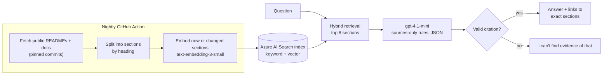

# Ask Barry

A portfolio assistant that answers questions about my software projects using **only** the documentation in my public GitHub repositories, and cites the repo, file and section behind every answer. If the documentation doesn't support a claim, it says so rather than guessing.

**Live:** https://ask-barry-7dkz.onrender.com

## Current status: Stage 6 complete (RAG live in production, answer quality evaluated)

**Retrieval-augmented generation is live in production:**
- Azure AI Search runs hybrid (keyword + vector) retrieval over my public repo documentation.
- Azure OpenAI (`gpt-4.1-mini`) writes a short answer that must cite the retrieved sections.
- The code refuses any answer without a valid citation.
- `/health` reports search, embeddings and generation as `true` when the Azure settings are present.

**Built so far** ([model card](docs/model-card.md)):
- Flask app with CI and Render deployment
- Document fetching and chunking
- BM25 baseline with a golden question set
- Azure setup
- Azure AI Search index with embeddings
- Retrieval comparison scored at section level
- Grounded answering with citations, rate limiting and a web UI
- Answer-quality evaluation with an evidence-checking LLM judge
- An MCP server, so AI assistants can query it as a tool
- Nightly index refresh, and a [model card](docs/model-card.md) with limits and an EU AI Act assessment

| Stage | Scope | Status |
|---|---|---|
| 0 | Skeleton: Flask, tests, CI, Render deploy | Done |
| 1 | Fetch public repo READMEs/docs and split them into sections (no AI) | Done |
| 2 | Keyword search baseline + evaluation question set | Done |
| 3 | Azure setup (Azure OpenAI, Azure AI Search) | Done: [guide](docs/azure-setup.md) |
| 4 | Embeddings + hybrid search in Azure AI Search | Done |
| 5 | Grounded answers with citations (RAG), live | Done |
| 6 | Answer-quality evaluation, including refusal of unsupported claims | Done |
| 7a | Nightly index refresh (GitHub Action) and a check for true-but-uncited answers | Done |
| 7b | Model card, architecture diagram, AI disclosure | Done: [model card](docs/model-card.md) |
| 7c | MCP server: Ask Barry as a tool for AI assistants | Done: [see below](#use-ask-barry-from-an-ai-assistant-mcp-stage-7) |
| 7d | Answer quality compared across model providers | Next |
| 7e | Infrastructure as code for this project's Azure resources | Planned |

## Architecture



How it works, what it's for (and not for), evaluation results, known limitations and the EU AI Act assessment are in the **[model card](docs/model-card.md)**.

## Sources

Only README and documentation files from my **public** GitHub repositories. No private repositories, source code, CV or personal details. Everything the assistant can see is already public.

## Build the document corpus (Stage 1)

```bash
python -m scripts.fetch_docs      # public, non-fork repos of BBSISK -> corpus/ + manifest.json
python -m scripts.chunk_corpus    # heading-aware chunks -> corpus/chunks.jsonl, with a summary
```

- **Selected files:** Markdown at each repo's root, anything under `docs/`, and README files at any depth. Forks, private repos, vendored folders and empty placeholders are skipped.
- **Excluded files:** `DEFAULT_EXCLUDED_PATHS` in `scripts/fetch_docs.py` leaves out public files that aren't evidence of my work, such as interview-rehearsal notes and domain reference catalogues. You can override it with `--exclude-paths`.
- **Pinned versions:** every file is fetched at an exact commit, so each chunk's GitHub link points at the version that was indexed.
- **Chunks:** each chunk carries its repo, file, heading breadcrumb and a link to the exact heading on GitHub (~500 tokens max, one paragraph of overlap, code blocks never split).
- `corpus/` is gitignored, so it can be rebuilt at any time. Set `GITHUB_TOKEN` (read-only) only if you hit the GitHub API rate limit.

## Evaluate retrieval (Stage 2)

```bash
python -m scripts.evaluate_retrieval          # print the report
python -m scripts.evaluate_retrieval --save   # also write docs/eval/<date>-bm25.md
```

- **Golden set:** `eval/golden_set.json` holds 37 answerable questions, each with the file that answers it, plus 8 **trap** questions about skills my public docs don't evidence. The final assistant must decline the traps.
- **No test leakage:** the evaluation reports under `docs/eval/` are excluded from the search corpus, and this README deliberately doesn't quote any test question. Otherwise the search would be "finding" the test instead of the evidence.
- **Results:** see the dated reports and the retriever comparison in [`docs/eval/`](docs/eval/).

## Index into Azure AI Search and compare retrievers (Stage 4)

```bash
python -m scripts.ingest --dry-run                          # what would change (no cost)
python -m scripts.ingest                                    # create index, embed, upload
python -m scripts.evaluate_retrieval --retriever all --save # BM25 vs Azure keyword / vector / hybrid
```

- **Index:** `ask-barry-chunks`, one document per chunk: text, repo, file, heading, GitHub link, and a 1536-dimension `text-embedding-3-small` vector (HNSW, cosine). The vector field is never returned in results.
- **Ingestion only re-embeds what changed:** chunks are compared by content hash, and chunks that disappear from the corpus (e.g. a repo made private) are deleted from the index.
- **Three query modes over the same index:** keyword (Azure BM25), vector (nearest neighbours), and hybrid (both, merged with Reciprocal Rank Fusion).
- **Tests:** all offline, with fake Azure clients, so CI needs no keys.
- **Scoring at section level:** a result counts only if it comes from the right file *and* contains the answer (evidence phrases in the golden set). File-level scoring alone overstated keyword search.
- **Result (27 Sep 2026, 59 chunks, 35 answerable questions), section level:**

  | Retriever | Recall@1 | Recall@5 | Recall@8 | MRR |
  |---|---|---|---|---|
  | BM25 (own implementation) | 0.66 | 0.91 | 0.91 | 0.77 |
  | Azure keyword | 0.74 | 0.94 | 0.94 | 0.81 |
  | Azure vector | 0.66 | 0.94 | 0.94 | 0.74 |
  | **Azure hybrid** | **0.80** | **0.94** | **1.00** | **0.86** |

- **Decision:** hybrid search, passing the top **8** chunks to the answering step (Stage 5), because it's the only setting that retrieved the answer for every question. With 35 questions, one question moves recall by about 0.03, so small gaps are noise. Full reports: [`docs/eval/`](docs/eval/).

## Grounded answers (Stage 5)

```bash
python -m scripts.ask "How does Wall Inspector deploy to production?"
python -m scripts.ask --show-context "<any question>"      # also list the retrieved sections
flask --app wsgi run                                       # web UI at http://127.0.0.1:5000
```

- **Pipeline:** question → Azure AI Search hybrid retrieval (top 8 sections, the Stage 4 decision) → numbered sources in the prompt → `gpt-4.1-mini` (temperature 0, JSON output) → citation check → answer with links.
- **Honesty rules enforced in code, not just the prompt:**
  - An answer must cite at least one of the sources it was given, or it is replaced with *"I can't find evidence of that in Barry's public GitHub documentation."*
  - Citations to sources that weren't provided are dropped.
  - Unparseable model output becomes an error, never raw text.
- **Web API:** `POST /api/ask {"question": "..."}` returns the answer, `supported`, and the cited sources (repo, file, section, GitHub link pinned to a commit).
- **Public-endpoint safeguards:**
  - Rate limits: 6 questions per minute per IP, and 300 a day overall.
  - Questions are capped at 300 characters, and the app doesn't log question text.
  - Model output is rendered as text, never HTML.
  - In production the app uses a read-only Search query key.

## Answer-quality evaluation (Stage 6)

```bash
python -m scripts.evaluate_answers --save                     # all questions -> docs/eval/<date>-answers.md
python -m scripts.evaluate_answers --ids profile-10 trap-01   # a subset
```

Each golden-set question is run through the full live pipeline (retrieval, generation and the honesty rules), then scored:

| Check | How |
|---|---|
| Answered | The system gave a supported answer, not "no evidence" |
| Cites the answer | At least one **cited** section is from the right file and contains the answer's evidence phrase (deterministic) |
| Faithful | An LLM judge confirms every claim is supported by the cited text, and that planned work isn't presented as done (or the reverse) |
| Regression checks | Fixed must / must-not phrases for known past failures, e.g. an answer that confused one project's roadmap with another project's history |
| Traps | Pass if the system refuses **or** gives a grounded "no". Fail only if it claims the skill (LLM judge) |

- **About the judge:** it's the same model family, so the headline numbers don't rest on it alone. The citation test and regression checks are deterministic.
- **Tokens per minute:** a full run makes about 80 model calls. Raise the chat deployment's limit (e.g. to 50K tokens per minute) so it isn't throttled; the client also backs off automatically on rate limits.

### Results (27 Sep 2026)

| Metric | Result |
|---|---|
| Answered (37 answerable questions) | 100% |
| Answer cites a section containing the answer | 100% |
| Faithful to cited sources (LLM judge) | 97% |
| Regression checks failed | 0 |
| Traps: no false claim (8 questions) | 100% |
| Passing every check | 44 of 45 |

Full report, including every answer for human review: [docs/eval/2026-09-27-answers.md](docs/eval/2026-09-27-answers.md).

What building the evaluator taught me:
- **Ask the judge for evidence, not a verdict.** The judge lists each claim with a quoted supporting passage, and code checks that every quote really appears in the sources. It matches whole words, so small rewordings pass but new content words don't. A bare yes/no judge gave false negatives that couldn't be audited.
- **Test the evaluator too.** Early versions failed correct answers because of formatting (backticks, HTML in diagrams), a token limit that cut off the judge's output, and a judge that couldn't see the source labels the answering model saw. Each fix came with a unit test.
- **Read the passing answers.** One trap answer passed but speculated about what related work "implied". The answer prompt and trap judge were tightened as a result.
- **Known remaining fault: true but uncited.** An answer occasionally states a fact from a section it retrieved but didn't cite, so the reader can't check it. It's recorded here rather than tuned away.
- **Single runs vary** by a few questions even at temperature 0, so failures are reviewed by cause rather than by headline number.

## Run locally

Requires Python 3.12 (3.10+ should work).

```bash
python3 -m venv .venv
source .venv/bin/activate
pip install -r requirements-dev.txt
cp .env.example .env          # local settings; .env is gitignored
python -m pytest -v           # run the tests
flask --app wsgi run          # open http://127.0.0.1:5000
```

## Deployment

`render.yaml` defines the Render web service (free plan). Render generates `SECRET_KEY` itself, and deploys only after GitHub Actions CI passes (`autoDeployTrigger: checksPass`).

## Use Ask Barry from an AI assistant (MCP, Stage 7)

`ask_barry_mcp.py` is a small [Model Context Protocol](https://modelcontextprotocol.io) server with one read-only tool, `ask_barry`. It lets Claude Desktop, Claude Code, Cursor or VS Code ask about my projects and get the same cited answers as the website.
- **A thin client:** it calls the live `/api/ask` endpoint, so it needs no Azure keys and inherits the live app's honesty rules and rate limits.
- **Structured output:** the answer, a `supported` flag and the cited sources (repo, file, section, link), so the assistant can keep the citations.
- **Built on the official MCP Python SDK** (stdio transport). Unit tests plus an in-memory client test cover the tool listing, schemas, results and errors.

```bash
pip install mcp                                              # or: pip install -r requirements-dev.txt
python ask_barry_mcp.py --check "How does Wall Inspector deploy to production?"   # smoke test, no MCP client needed
```

Claude Code:

```bash
claude mcp add ask-barry -- /path/to/ask-barry/.venv/bin/python /path/to/ask-barry/ask_barry_mcp.py
```

Claude Desktop (`claude_desktop_config.json`):

```json
{
  "mcpServers": {
    "ask-barry": {
      "command": "/path/to/ask-barry/.venv/bin/python",
      "args": ["/path/to/ask-barry/ask_barry_mcp.py"]
    }
  }
}
```

## Keeping the index fresh (Stage 7)

A GitHub Action (`.github/workflows/refresh-index.yml`) runs every night and on demand. It fetches the public docs, chunks them and syncs Azure AI Search, so answers keep up with README changes without a manual step.
- **Cheap when nothing changed:** only new or changed sections are re-embedded.
- **Safe when unattended:** the sync refuses to run on an empty corpus, or if it would delete more than 30% of the index (for example after a rate-limited fetch). A deliberate large removal needs `--allow-large-delete` run by hand.
- **Secrets:** Azure settings come from GitHub Actions secrets. The Search admin key lives only there, because this job writes to the index. The live app uses a read-only query key.

The evaluation also checks citation completeness. The judge sees the retrieved sections the answer did *not* cite, so a claim supported only by one of those is reported as **"true but uncited"**, separately from an invented claim. Both count as failures, because a reader can only check what is cited.

## Security

Secrets are environment variables only. The app refuses to start in production without `SECRET_KEY`.
